# TDW vendor app: a review for ease of use, polish, colour and type

Review and proposal only. No production file was changed. Everything here lives on the branch
`review/ux-simplification`, under `docs/review/`.

Walked on 28 September 2026 in the app's own mock mode (the method of benches b140 and b143), headless Chromium at
374 by 812 (iPhone) and 360 by 800 (Android), in Graphite (dark) and Chalk (light). How to reproduce it is in
[section 9](#9-how-the-review-was-run).

---

## 1. Summary

**The app can do a lot, but a vendor has to find each job.** The five things a vendor does every day are spread
over more than thirty "rooms" behind a two-button bottom bar. One record (an enquiry, an event) opens as a sheet that
opens another sheet. The light theme is mostly pure white. The page titles and figures are in a decorative serif.

### The ten changes that would make the biggest difference, ranked

1. **Put the five daily jobs in the bottom bar: Today, Enquiries, Calendar, Clients, Money.** Move the other 25 rooms
   (Portfolio, Storefront, Posts, Collab, TDS and so on) into one "More" list under the profile. Today a vendor
   taps Rooms, then scans a list of 30 to reach a daily job. *Large.*
2. **Make Home the day's work, in this order:** enquiries to reply to (with their last message), today's events
   (with their crew), money due, and a "Check a date" box. The six pinned tiles, the big "4 open items" number and
   the "Done today 0 0 0" table go. *Medium.*
3. **One Book button on an enquiry.** It asks for the package (fee, dates and advance already filled in), then
   books the client, **makes the invoice** and **puts the days in the calendar**. Today it takes 7 taps over
   three stacked sheets, and the invoice and the calendar days are separate jobs after that. *Large.*
4. **Show the crew wherever an event shows:** on Home, in the week, on the event. Today the crew is only inside
   the Calendar's day sheet, 4 taps away for each event. *Medium.*
5. **Give every record its own page** (enquiry, client, event, invoice) with a fixed bar of at most two buttons and
   a "More" button. Use sheets only for short tasks, and never open a sheet on top of a sheet. *Large.*
6. **Answer "am I free?" in words: Free, Booked or Enquiry.** Add "Check a date" to Home and let the month title
   jump to any month. Today it is 8 taps and the day sheet never says "free". *Medium.*
7. **Soften the light theme and fix contrast.** Adopt the Teal Ledger palette below: the light page is a stone
   grey, not white, and every text and button pair passes. Today the light add button and send arrow measure
   2.71 to 1 and the light primary buttons 3.35 to 1. *Quick for the fixes, medium for the palette.*
8. **One business-like font.** Inter for everything, 16 px body text, sentence case, no letter-spaced capitals.
   The serif goes (or stays only in the TDW name). *Medium.*
9. **Make every control 44 px and clear the notch.** 87 controls measured under 44 px across the rooms; the
   header sits under the iPhone status bar when the app is installed. *Quick.*
10. **Plain words everywhere.** "Leads" and "Enquiries" become one word; "Rooms", "Anno", "Loose engagements",
    "Hot dates", "Edit Here" go; no dashes, no "she", no raw "10:00:00 · shoot · morning". *Quick.*

**Recommended palette: Teal Ledger.** It keeps the TDW teal recognisable, moves the light theme onto warm stone
greys (the page is 14 percent darker than white), and its weakest text pair is 5.23 to 1.

**Recommended type: Inter for everything (option A).** It was drawn for screens, has clear, even-width figures for
rupee amounts, and reads as business software at 13 to 16 px.

| | Today | Proposed |
|---|---|---|
| Reply to a new enquiry | 2 taps and a scroll | 2 taps, message already on Home |
| Is a date free? | 8 taps, 4 screens | 2 taps, 1 sheet |
| Enquiry to booked client with a package | 7 taps (9 to see the client), invoice and calendar still to do | 4 taps, invoice and calendar done |
| Send an invoice; who owes money | 8 taps; 2 taps to see who owes | 3 taps from the client; 1 tap to see who owes |
| Today's and this week's events with crew | crew not on Home; 4 taps per event; week shows initials | 0 taps for today, 1 tap for the week |

The three worst, redesigned, before and after:
[date](mocks/flow-b-check-a-date.png) · [enquiry to client](mocks/flow-c-enquiry-to-booked-client.png) ·
[events with crew](mocks/flow-e-today-and-week-with-crew.png).
Clickable versions: [html/index.html](html/index.html).

Review time: about 40 minutes ([section 10](#10-time)).

---

## 2. The five daily tasks

Each was walked from Home (`/vendor/today`) in the real app, every step screenshotted in dark on iPhone
(`screenshots/flows/<task>/dark-ios-*`) and again in light on Android (`light-android-*`). A tap on a list
counts as one tap; picking from a drop-down counts as two (open, pick).

### (a) See and reply to a new enquiry

| Step | Today | Screenshot |
|---|---|---|
| 1 | Home shows "Aanya Kapoor, Jaipur · 14 Feb 2027 · Rs 15,00,000 – Rs 25,00,000". Not the message. | [01](screenshots/flows/a-reply-to-enquiry/dark-ios-01-home.png) |
| 2 | Tap it: the Leads room opens with a sheet. Package buttons, "Still missing", a table of fields, then six buttons. | [02](screenshots/flows/a-reply-to-enquiry/dark-ios-02-open-enquiry.png) |
| 3 | Scroll the sheet to find the conversation, which comes last. | [03](screenshots/flows/a-reply-to-enquiry/dark-ios-03-scroll-to-conversation.png) |
| 4 | Tap WhatsApp; the reply is written in WhatsApp. | [04](screenshots/flows/a-reply-to-enquiry/dark-ios-04-whatsapp-button.png) |

**Today: 2 taps and a scroll, 2 screens then WhatsApp. Proposed: 2 taps, no scroll.** Home shows the last message
on the enquiry card. The enquiry page opens on "You are free on 14 Feb" and the conversation, with quick replies
(Share packages, Ask for a call time, Date is free) and a fixed bar: **Reply**, **Book**, **More**. Board:
[mocks/flow-a-reply-to-enquiry.png](mocks/flow-a-reply-to-enquiry.png).

### (b) Check whether a date is free

| Step | Today | Screenshot |
|---|---|---|
| 1 | Home. The only date tool is the Ask TDW bar (a chat). | [01](screenshots/flows/b-check-a-date/dark-ios-01-home.png) |
| 2 | Tap Rooms. | [02](screenshots/flows/b-check-a-date/dark-ios-02-rooms.png) |
| 3 | Tap Calendar: September. | [03](screenshots/flows/b-check-a-date/dark-ios-03-calendar.png) |
| 4 | Tap the 36 px "›" five times to reach February. | [04](screenshots/flows/b-check-a-date/dark-ios-04-next-month-x5.png) |
| 5 | Tap 14: the day sheet lists what is on it, but never says "free" or "booked". | [05](screenshots/flows/b-check-a-date/dark-ios-05-day-14.png) |

**Today: 8 taps, 4 screens. Proposed: 2 taps, 1 sheet.** "Check a date" on Home opens a sheet with a date picker;
the answer is one word in a coloured box (**Free all day**, **Booked**, **Enquiry**), then who asked for it and what
is next to it, with **Hold this date** and **Open in calendar**. In the Calendar, the month title is a button that
jumps to any month, and days are drawn as booked (filled), enquiry (outlined) or blocked (struck through), with a
legend. Board: [mocks/flow-b-check-a-date.png](mocks/flow-b-check-a-date.png).

### (c) Turn an enquiry into a booked client with a package

| Step | Today | Screenshot |
|---|---|---|
| 1 | Home | [01](screenshots/flows/c-enquiry-to-booked-client/dark-ios-01-home.png) |
| 2 | Tap the enquiry: sheet | [02](screenshots/flows/c-enquiry-to-booked-client/dark-ios-02-open-enquiry.png) |
| 3 | Tap Attach package: a second sheet with nine fields | [03](screenshots/flows/c-enquiry-to-booked-client/dark-ios-03-attach-package.png) |
| 4 | Open the package list, pick "Full wedding" (fee fills in) | [04](screenshots/flows/c-enquiry-to-booked-client/dark-ios-04-choose-package-fee-fills.png) |
| 5 | Tap Attach package | [05](screenshots/flows/c-enquiry-to-booked-client/dark-ios-05-attach.png) |
| 6 | Tap Booking confirmed: a third sheet | [06](screenshots/flows/c-enquiry-to-booked-client/dark-ios-06-booking-confirmed.png) |
| 7 | Tap Confirm booking | [07](screenshots/flows/c-enquiry-to-booked-client/dark-ios-07-confirm-booking.png) |
| 8, 9 | Rooms, Clients: the client is a row that expands in place; no invoice, no functions | [09](screenshots/flows/c-enquiry-to-booked-client/dark-ios-09-clients-room.png) |

After this the vendor still makes the invoice (task d, 8 taps) and adds each function in the Calendar.

**Today: 7 taps to book, 9 to see the client, 6 screens and sheets. Proposed: 4 taps, 3 screens.** Home, tap the
enquiry, tap **Book**, pick the package in one sheet (fee, dates from the enquiry and the advance filled in; a line
says what booking will do), tap **Book and make invoice**. The vendor lands on the client's page: paid and due,
the functions with crew, the invoice. Board:
[mocks/flow-c-enquiry-to-booked-client.png](mocks/flow-c-enquiry-to-booked-client.png).

### (d) Send an invoice and see who still owes money

| Step | Today | Screenshot |
|---|---|---|
| 1 | Home shows one invoice due. | [01](screenshots/flows/d-send-invoice-and-see-who-owes/dark-ios-01-home.png) |
| 2, 3 | Rooms, Invoices: "Rs 3,40,000 Outstanding · 2 open". This is where "who owes" is. | [03](screenshots/flows/d-send-invoice-and-see-who-owes/dark-ios-03-invoices.png) |
| 4 | Tap +: New invoice. | [04](screenshots/flows/d-send-invoice-and-see-who-owes/dark-ios-04-new-invoice.png) |
| 5 | Type the client's name by hand, type the amount. | [05](screenshots/flows/d-send-invoice-and-see-who-owes/dark-ios-05-fill.png) |
| 6, 7 | Create invoice, open it. | [06](screenshots/flows/d-send-invoice-and-see-who-owes/dark-ios-06-create-then-open-an-invoice.png) |
| 8 | Send on WhatsApp (the second of three large buttons). | [07](screenshots/flows/d-send-invoice-and-see-who-owes/dark-ios-07-send-on-whatsapp.png) |

**Today: 8 taps to send; 2 taps to see who owes. Proposed: 3 taps to send from the client, 1 tap to see who
owes.** Money is a tab: the total owed, then each client by due date. On a client's page, **Send reminder** opens
one sheet with the invoice and a ready message; **Send on WhatsApp**. A new invoice starts from a client (or a
client picker), never from a typed name. Board: [mocks/flow-d-send-invoice.png](mocks/flow-d-send-invoice.png).

### (e) See today's and this week's events with their crew

| Step | Today | Screenshot |
|---|---|---|
| 1, 2 | Home: scroll past the tiles to Events: "Meera and Kunal Haldi, 10:00:00 · shoot · morning". No crew. | [02](screenshots/flows/e-today-and-week-with-crew/dark-ios-02-home-scrolled-events.png) |
| 3 | Tap it: the Events room's sheet (kind, date, time, state, notes). No crew. | [03](screenshots/flows/e-today-and-week-with-crew/dark-ios-03-event-sheet-no-crew.png) |
| 4, 5, 6 | Rooms, Calendar, tap today: the day sheet, five buttons per event. Still no crew names. | [06](screenshots/flows/e-today-and-week-with-crew/dark-ios-06-today-28.png) |
| 7 | Tap Crew: "Assign crew" shows who is ticked. One event. Close, repeat for the next. | [07](screenshots/flows/e-today-and-week-with-crew/dark-ios-07-crew-for-haldi.png) |
| 8 | For the week: Calendar, Weddings: initials in circles ("RS", "AV"), "shoot", no times. | [08](screenshots/flows/e-today-and-week-with-crew/dark-ios-08-close-then-weddings-view.png) |

**Today: crew not on Home; 4 taps to see one event's crew, 6 for two; 3 taps for a week view in initials.
Proposed: 0 taps for today, 1 for the week, 1 more for an event.** Each event card shows the time, the function and
the couple, the place, and the crew by first name with a tick (confirmed) or a clock (not yet replied). A function
with nobody on it says "No crew yet" in red. The event page lists the crew with role and fee, and has **Message
crew**. Board: [mocks/flow-e-today-and-week-with-crew.png](mocks/flow-e-today-and-week-with-crew.png).

---

## 3. The simpler app

### What a vendor sees first

Home is the day, in the order a vendor acts on it:

1. **Check a date** (a box, always at the top).
2. **Reply to**: new enquiries, each with its last message and how long ago.
3. **Today**: each function with time, place and crew. A "This week" link.
4. **Money due**: one line, "Rs 3,40,000 owed · 2 clients · next due 1 Oct".

Nothing else. Pinned tiles, the "open items" numeral, the kind line ("1 lead · 1 invoice · 2 events") and the
"Done today" table are removed; each repeats something the list already shows.

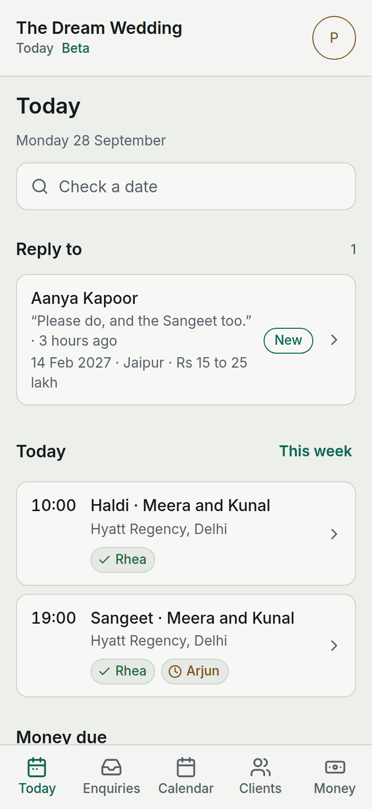

### Five tabs

| Tab | Holds (today's rooms) |
|---|---|
| **Today** | Home, Events (as "This week"), Notes due today |
| **Enquiries** | Leads, enquiry routing (Settings), referrals received |
| **Calendar** | Calendar, blocked dates, hot dates (as a quiet mark, not red), crew per day |
| **Clients** | Clients, contracts, notes on a couple, the client's invoices |
| **Money** | Invoices, payment reminders, expenses, TDS, Books, Billing |

Everything else goes into **More** (the profile coin): Packages, Team, Storefront, Portfolio, Wedding pages, Your
website, Posts and ads, Collab, Influencer exchange, Introductions, Referrals, Google reviews, Couture, WhatsApp and
Instagram, Advisor, Business Solutions, Settings, Support. These are set up once or visited weekly; they do not
need a place on every screen.

**Ask TDW** moves from a permanent 64 px bar on every screen to a button in Home's header and in the search field
of each tab. The screen space goes back to the work.

### What to merge

- **Leads and the lead sheet's Package block into one enquiry page**, with Book as its main action.
- **Events into Calendar**: one place for functions, with a Week and a Month view.
- **Attach package, Booking confirmed and Advance paid into Book** (one sheet, one button).
- **Clients' inline expansion into a client page** (money, functions, invoices, contract, notes, conversation).
- **Invoices, Payment reminders, Expenses, TDS and Books into Money**, as tabs on one page.
- **Team's crew into the event**: assign and see crew where the event is, not in another room.

### What to hide until needed

- "Still missing: + Budget" chips: show only when the missing field blocks something (a quote needs a budget).
- Forward to a peer, Mark lost, Delete, Edit: under **More** on the record's page.
- Payment schedule editing: behind "Change plan" on the invoice.
- The "?" help: keep it, but only on a room's first visit; then only in More.
- Hot dates: a small mark on the day, explained in the legend.

### One pattern for lists, pages and sheets

| Piece | The rule |
|---|---|
| **List row** | 64 px or more. Line 1: the name (16 px, medium). Line 2: one line of facts (14 px). Right: one thing only, an amount or a status. A chevron. No letter avatars, no second or third chip line. |
| **Status** | A small pill in sentence case (New, Part paid, Confirmed). Colour by meaning: teal for new, green for done, amber for waiting, red for overdue. |
| **Record page** | Back link, title (22 px), one line of facts, a summary card, then sections. A fixed bar at the bottom: one primary button, one secondary, and More. Never more than two levels deep: tab, then record. |
| **Sheet** | For one short task (Book, Check a date, Send invoice). A title and a close button, the fields, one full-width primary button at the bottom. Never a sheet on a sheet. |
| **Buttons** | 48 px high, 12 px corners, one primary colour for the whole app (the palette's Button), outlined for secondary, red text only for Delete, and Delete only under More. |
| **Numbers** | Rupees with tabular figures, "Rs 1,90,000", always the same size in a list. |
| **Words** | Sentence case, no letter-spacing, no dashes. "Enquiry" everywhere, never "lead". |

The proposed screens, in the recommended palette:

| Today | Enquiry | Book | Client | Event | Money |
|---|---|---|---|---|---|
| 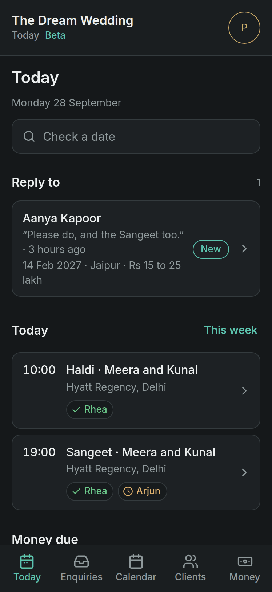 | 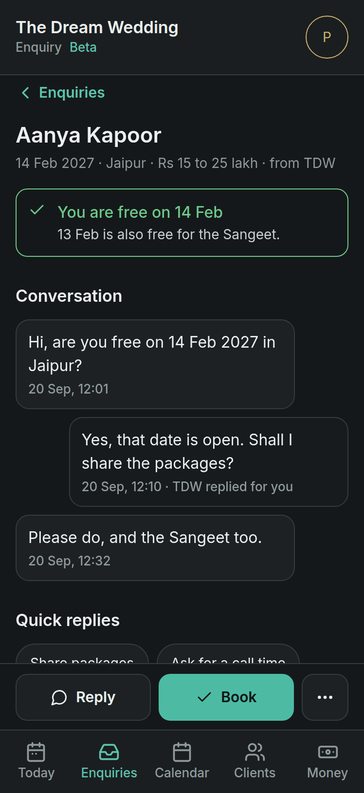 | 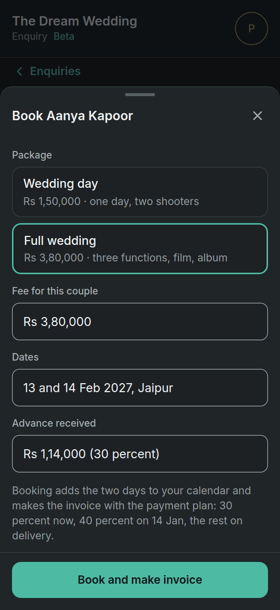 | 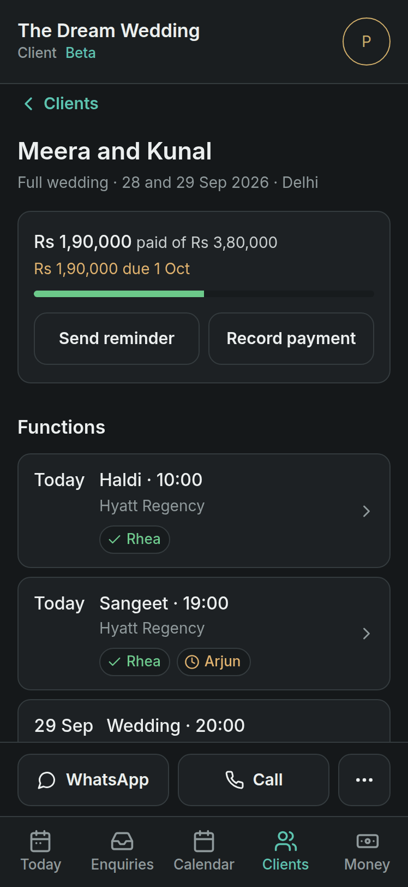 | 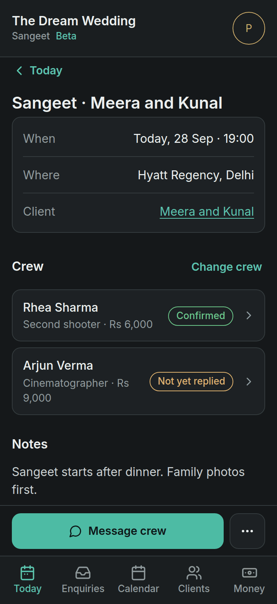 | 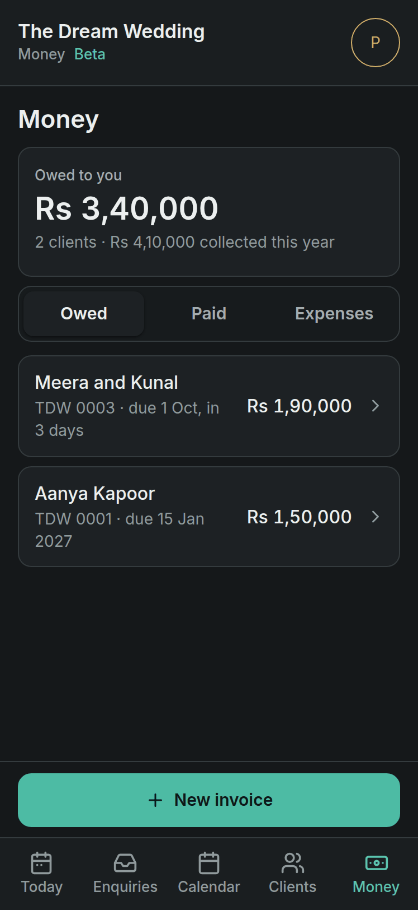 |
|  | 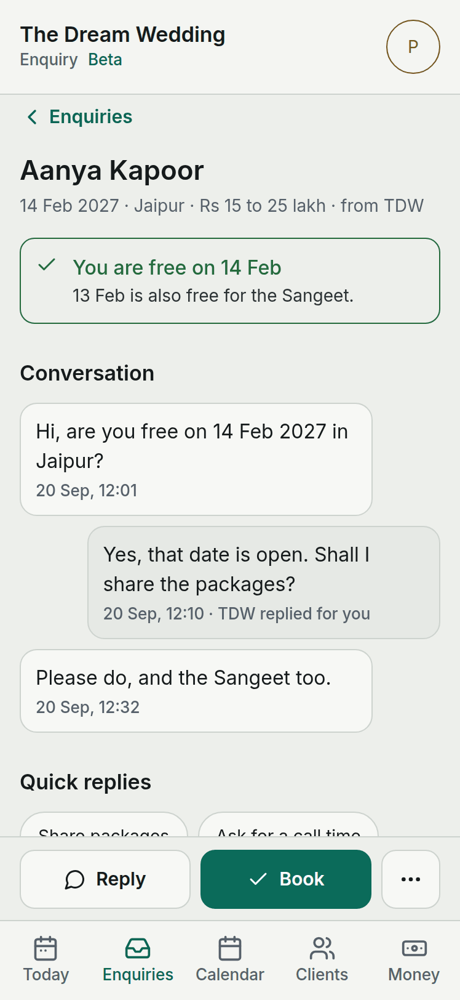 | 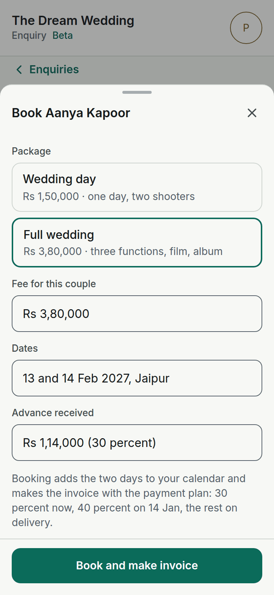 | 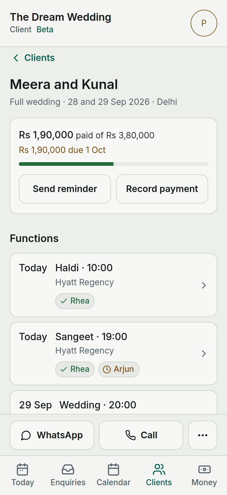 | 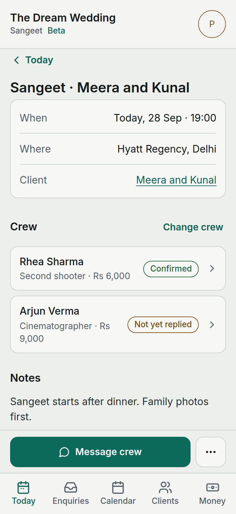 | 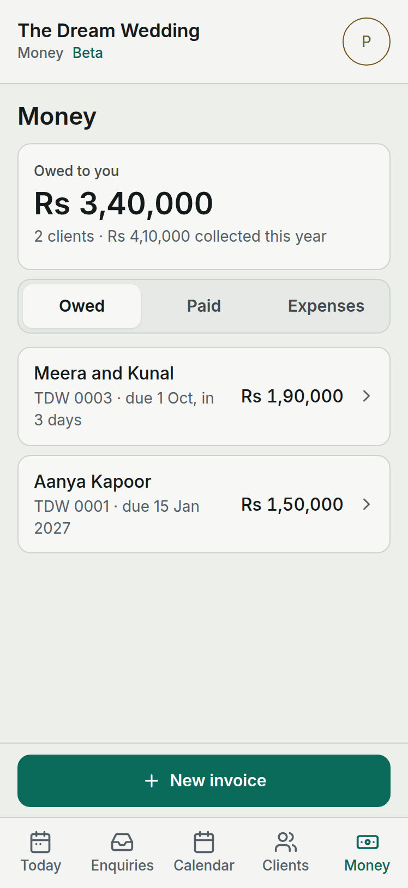 |

More in `mocks/after/` (week, date, calendar, clients, invoice, and three on Android at 360 wide).

---

## 4. Colour

### What is wrong today

- **Chalk is white where it matters.** The header, every sheet and the cards are `#FFFFFF` or 94 percent white
  (header and sheet luminance 1.00, the page 0.90). On a phone at full brightness this is the glare the founder
  describes. [screenshots/findings/light-white-grounds.png](screenshots/findings/light-white-grounds.png)
- **Four pairs fail in the running app** (measured on screen, section 8): the add button's "+" and the send arrow
  in light (2.71 to 1, dark ink on dark teal); white text on the light primary buttons (3.35 to 1); gold headings
  in light (4.34 to 1); faded text used for real words (2.68 to 1 dark, 3.84 to 1 light).
- **Two primary colours**: teal and gold both fill buttons (Save crew and Get started are gold).

### Three palettes

Each is a complete set of values for the shell's 33 tokens (`lib/worklist/theme.ts`, GRAPHITE and CHALK) plus two
new ones, `primary` and `on-primary`, so a filled button never again borrows the link colour
(`accent-text`) and the deepest ink (`ink-deep`), which is why the light "+" fails today. Cards become solid
colours instead of translucent gradients. All values: [palettes/palettes.json](palettes/palettes.json). Every pair,
measured: [palettes/CONTRAST.md](palettes/CONTRAST.md) (318 pairs, all pass).

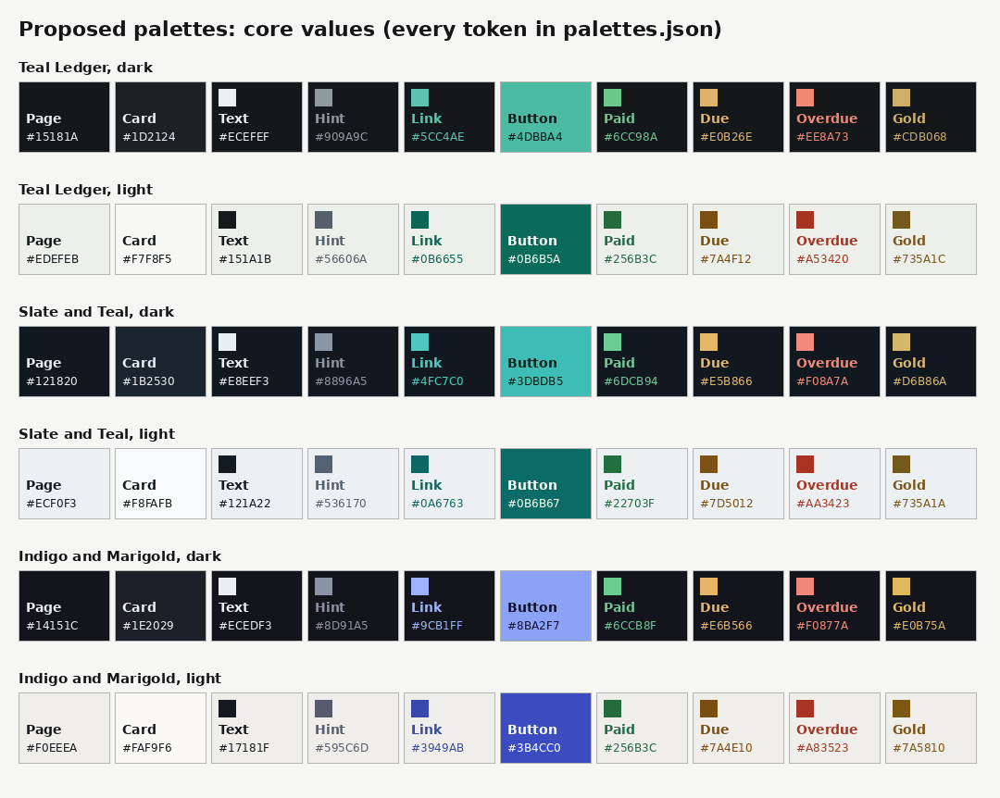

| Palette | Light page | Weakest text pair | Weakest control pair | Character |
|---|---|---|---|---|
| **Teal Ledger** (recommended) | `#EDEFEB`, luminance 0.86 | 5.37 dark, 5.23 light | 5.37 dark, 5.54 light | TDW teal deepened; warm stone greys. Closest to today, calmer. |
| **Slate and Teal** | `#ECF0F3`, 0.87 | 4.82 dark, 5.01 light | 4.82 dark, 5.53 light | Cool blue greys, brighter teal. Most like a business tool. |
| **Indigo and Marigold** | `#F0EEEA`, 0.86 | 4.95 dark, 5.23 light | 4.95 dark, 5.71 light | No teal. Indigo actions, marigold brand. The most formal. |

Luminance: white is 1.00; today's light page is 0.90 and its sheets 1.00. All three proposed light pages sit at
0.86 to 0.87, and their cards at 0.94 to 0.95, a clearly softer ground.

The pairs measured for each palette and theme: main text, second text, labels, hints, links, paid, due, overdue and
gold on each of the five grounds (behind everything, page, header, card, sheet) at 4.5 to 1; button text on the
primary button and text on the gold coin at 4.5 to 1; the primary button against the page, a card and a sheet, the
field and outline edge on a sheet and on the page, and the delete outline, at 3 to 1.

| | Dark | Light |
|---|---|---|
| Teal Ledger | [board](palettes/ledger.png) | same board, second row |
| Slate and Teal | [board](palettes/slate.png) | same board, second row |
| Indigo and Marigold | [board](palettes/indigo.png) | same board, second row |

Each board shows Today, Enquiries and a client's page. Switch between them live: [html/palettes.html](html/palettes.html).

**Why Teal Ledger.** The founder asked for the teal to stay recognisable; Teal Ledger keeps it, so the brand and
the existing screenshots and store listing do not change character, and it has the most contrast headroom of the
three (no pair under 5.2 to 1). Slate and Teal is a close second if a cooler, more "software" feel is wanted.

**How it would land.** Replace the values in GRAPHITE and CHALK, add `primary` and `on-primary`, and point the
filled buttons (`.wl-fab`, `.wl-docksend`, `.atelier-fab`) at them. The token count cell (33) becomes 35.

---

## 5. Type

### Today

Cormorant Garamond (a display serif) sets every page title, the Today numeral, sheet titles and, in Packages and
Wedding pages, prices, whose old-style figures ("Rs 1,50,000" with dropping 5 and 0) are hard to scan. DM Sans sets
the rest at 14 px body, 12 px buttons and 11 px labels, many of them in letter-spaced capitals. The legacy pages
(onboarding, Discover) add italic serifs, Italiana and 9 px text.

### Two options

| | **A: Inter everywhere** (recommended) | **B: IBM Plex Sans, serif for the TDW name** |
|---|---|---|
| App text | Inter 400, 500, 600 | IBM Plex Sans 400, 500, 600 |
| The TDW name | Inter 600 | Cormorant Garamond 600, header only |
| Why | Made for screens; tall lower case reads well at 13 px; tabular figures for money; the look of modern business software. | A little more character and warmth; keeps a trace of the serif brand where it is a logo, not a title. |
| Cost | One family, about 70 KB for three weights (Latin) | Two families, about 100 KB |

Both are free (SIL Open Font License), on Google Fonts, and load through `next/font/google` as the current faces do.

### Sizes

Set in rem, so the text follows the phone's own text size: Android Chrome scales rem with its text setting, and on
iOS the root can follow Dynamic Type with `font: -apple-system-body` on `html`. At the default size:

| Use | Size | Weight | Line height | At 130 percent |
|---|---|---|---|---|
| Page title | 22 px (1.375 rem) | 600 | 28 px | 28.6 px |
| The one big figure (money owed) | 28 px (1.75 rem) | 600 | 32 px | 36.4 px |
| Section title, sheet title | 17 px (1.0625 rem) | 600 | 23 px | 22.1 px |
| Body, row title, input | 16 px (1 rem) | 400 and 500 | 24 px | 20.8 px |
| Second line in a row | 14 px (0.875 rem) | 400 | 20 px | 18.2 px |
| Buttons | 15 px (0.9375 rem) | 600 | 20 px | 19.5 px |
| Small text, labels, pills (the floor) | 13 px (0.8125 rem) | 500 | 18 px | 16.9 px |

Rules: nothing under 13 px; sentence case, no letter-spacing; no italic; tabular figures on money and times; the
bottom bar's labels are capped at 14 px (as iOS caps its own tab bar) so five tabs still fit at the largest size.

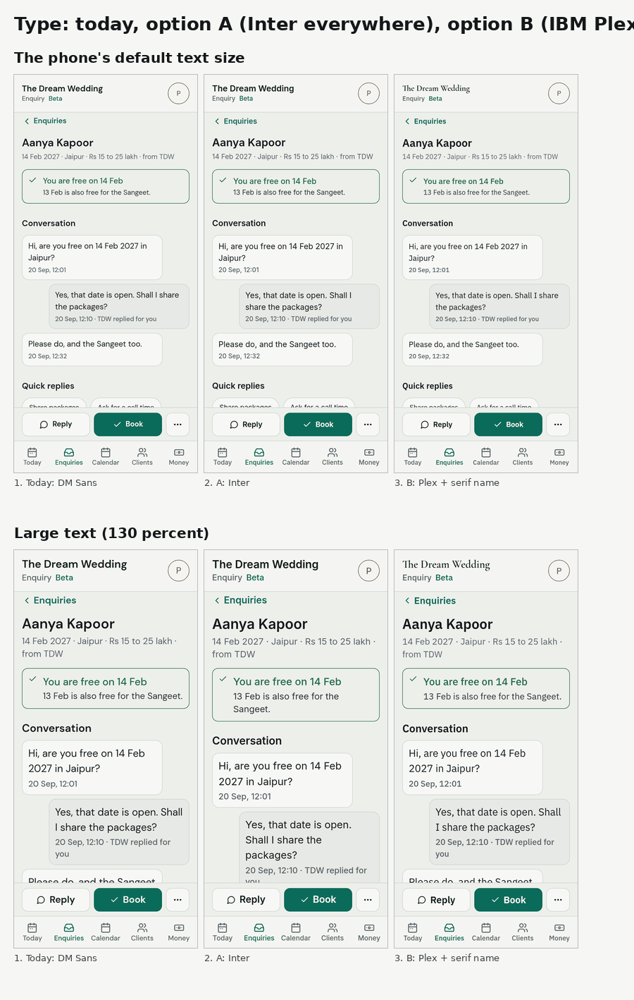

The top row is the phone's default size; the bottom row is 130 percent. Today's body is 14 px and its labels 11 px;
option A's are 16 and 13, and both scale with the phone's setting.

---

## 6. Mocks and prototypes

- **The prototype page** ([proto/page.tsx](proto/page.tsx)) mounts the app's own `WorklistShell` (header, room
  head, profile coin), sets the shell's own token variables to a palette, and draws the proposed screens from
  [html/screens.js](html/screens.js). For the screenshots it is copied into `app/vendor/(shell)/review-proto/` and
  removed after each run ([tools/mocks.mjs](tools/mocks.mjs)); it is not in the branch's `app/`.
- **Before and after**, the three worst flows: [mocks/flow-b-check-a-date.png](mocks/flow-b-check-a-date.png),
  [mocks/flow-c-enquiry-to-booked-client.png](mocks/flow-c-enquiry-to-booked-client.png),
  [mocks/flow-e-today-and-week-with-crew.png](mocks/flow-e-today-and-week-with-crew.png). The other two:
  [mocks/flow-a-reply-to-enquiry.png](mocks/flow-a-reply-to-enquiry.png), [mocks/flow-d-send-invoice.png](mocks/flow-d-send-invoice.png).
- **Leads, Today and a client in each palette, both themes, recommended type**: `mocks/palettes/<palette>-<theme>-<screen>.png`
  (18 images) and the boards in `palettes/`.
- **Clickable HTML** in [html/](html/index.html): [leads-flow.html](html/leads-flow.html) (enquiry, reply, book,
  client), [date-flow.html](html/date-flow.html), [crew-flow.html](html/crew-flow.html),
  [money-flow.html](html/money-flow.html), and [palettes.html](html/palettes.html) with the palette, type and
  theme switchers. They open from a file on any phone or computer, with no build and no server. They draw with the
  shell's own CSS and chrome copied out of the running app (`html/shell/`, by [tools/extract-shell.mjs](tools/extract-shell.mjs)),
  the app's fonts and the proposed ones (`html/fonts/`), and the palette values generated from the same source as
  `palettes.json` (`html/tokens.js`). Screenshots of them: `mocks/html/`.

---

## 7. Every finding

Size: **quick** is under a day, **medium** a few days, **large** a week or more. Rooms not named here were walked
and measured with nothing to report beyond the app-wide findings. Every room's first screen, in both themes and
both phones, is in `screenshots/rooms/<room>-<theme>-<ios|android>.png`; the measures behind them are in
`tools/data/tour-*.json`.

### Ease of use

#### E1. Two tabs and thirty rooms · Rooms · large
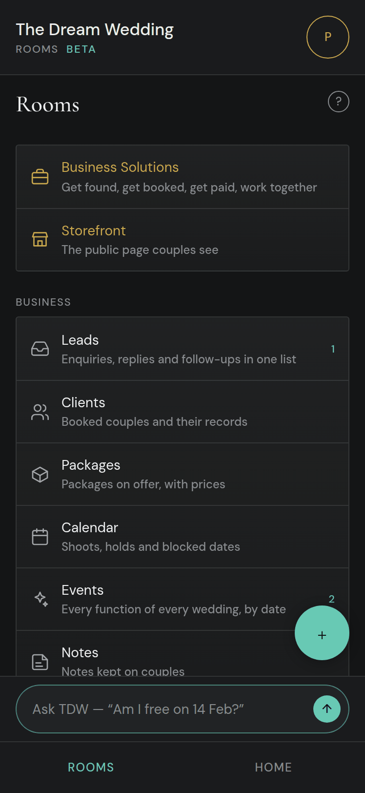

**Why it matters.** The bottom bar has two seats, Rooms and Home. Every daily job except Home is one tap to Rooms
and a scan of a list of 30 rooms in six bands, where Leads sits under "Business Solutions" and "Storefront". A
vendor between functions cannot learn this by thumb.
**Fix.** Five tabs (Today, Enquiries, Calendar, Clients, Money); the rest in More. Section 3.

#### E2. Home opens with tiles, not the day · Home · medium
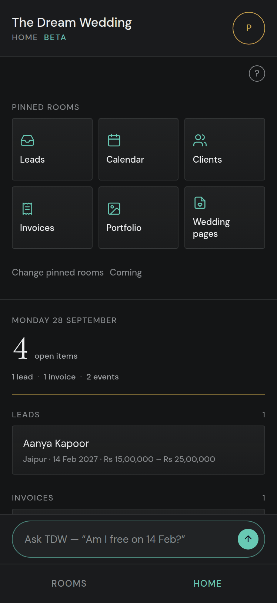

**Why.** The first 330 px are six pinned tiles and "Change pinned rooms · Coming" (a control that does nothing).
Today's events start below the fold on an iPhone. The "4 open items" numeral and "1 lead · 1 invoice · 2 events"
say what the list below says.
**Fix.** Home as in section 3: Check a date, Reply to, Today, Money due.

#### E3. The enquiry sheet: ten buttons before the conversation · Leads · medium
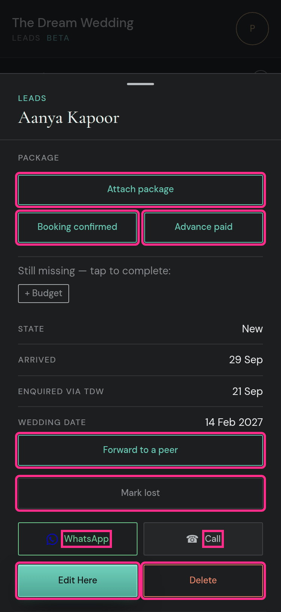

**Why.** Attach package, Booking confirmed, Advance paid, + Budget, Forward to a peer, Mark lost, WhatsApp, Call,
Edit Here, Delete: ten equal buttons. The conversation, the one thing needed to reply, is last and needs a scroll.
Delete has the same size and place as the main actions.
**Fix.** An enquiry page: the date answer and the conversation first, then facts; a fixed bar with Reply, Book and
More (Call, Forward, Mark lost, Edit, Delete).

#### E4. Booking is three sheets deep and nine fields long · Leads · large
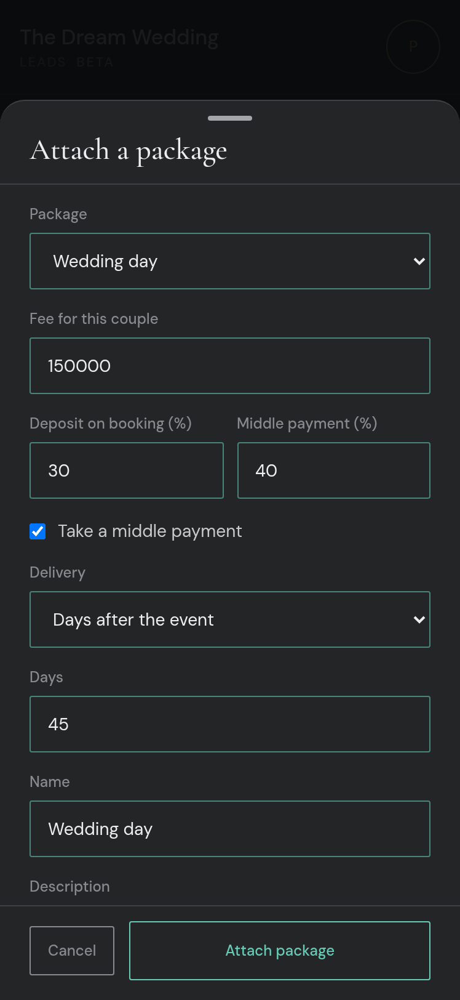

**Why.** Attach package opens a sheet on the enquiry sheet with package, fee, deposit percent, middle percent, a
checkbox, delivery, days, name and description. Then Booking confirmed opens a third sheet. Most vendors book the
package as it is.
**Fix.** One Book sheet: package (as two or three cards), fee, dates and advance filled in, one button. Percentages,
delivery and the name under "Change payment plan".

#### E5. Booking does not make the invoice or the calendar days · Leads, Clients · large
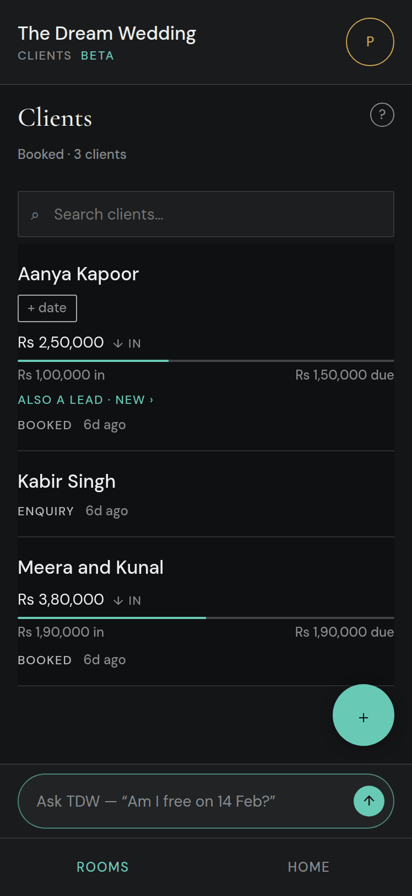

**Why.** After booking, the client row has no functions and no invoice. The vendor makes the invoice in another
room, typing the name, and adds each function in the Calendar. Three jobs for one decision.
**Fix.** Book makes the invoice with the package's payment plan and adds the enquiry's dates as functions, then
opens the client page.

#### E6. No crew on Home, in Events or on the event · Home, Events · medium
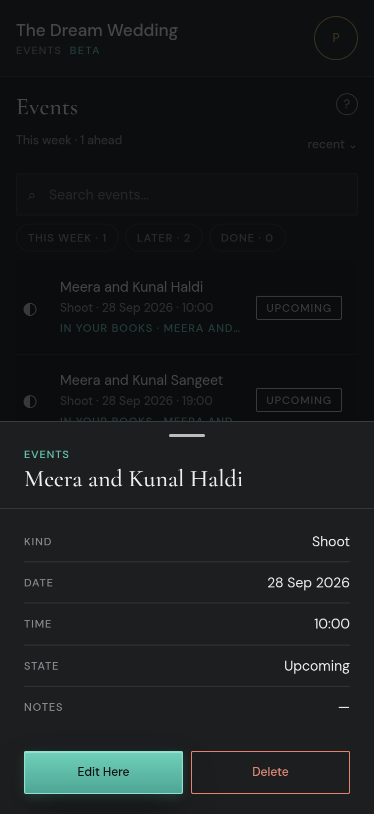

**Why.** The first question on a shoot day is "who is coming". The crew is only in the Calendar's day sheet, behind a
Crew button, per event.
**Fix.** Crew names with confirmed or not yet replied on every event card and page; "No crew yet" in red.

#### E7. The Weddings view shows initials and "shoot" · Calendar · medium
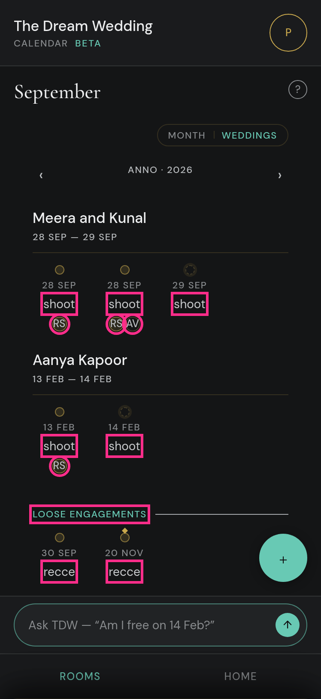

**Why.** "RS", "AV" in circles, "shoot" in lower case, no time, no function name (Haldi, Sangeet), and a pending
crew member looks the same as a confirmed one. "Loose engagements" is not a phrase a vendor uses.
**Fix.** The week list of section 3 (time, function, couple, place, crew by first name with a tick or a clock).

#### E8. Five equal buttons on each event in the day sheet · Calendar · medium
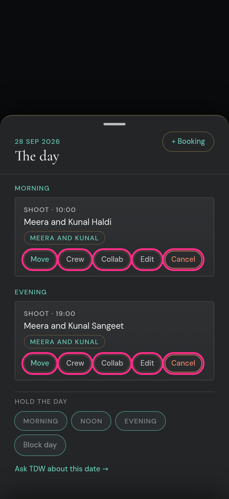

**Why.** Move, Crew, Collab, Edit, Cancel on every event, each 32 px high, with Cancel in red beside Edit.
**Fix.** Tap the event to open its page; keep Crew visible; Move, Collab, Edit, Cancel under More.

#### E9. The calendar never says "free" · Calendar · medium
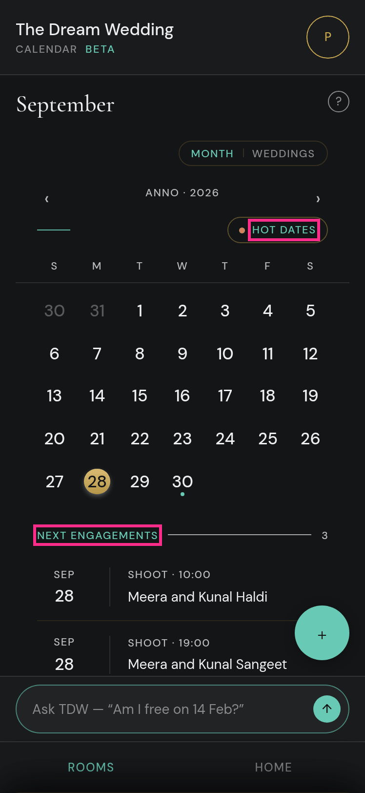

**Why.** The only way to a far month is "›" one month at a time; a day's sheet lists events but not the answer. "Anno
· 2026", "Next engagements" and "Hot dates" in red (red reads as a problem, but these are good dates) add noise.
**Fix.** Check a date (section 2b); the month title opens a month and year picker; days drawn as booked, enquiry,
blocked with a legend; hot dates as a small mark.

#### E10. An enquiry listed under "Booked", and no client page · Clients · medium
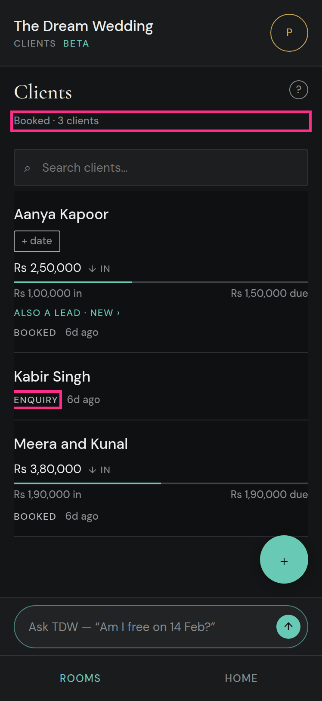

**Why.** The head says "Booked · 3 clients" and the list includes Kabir Singh, marked Enquiry. A client opens in
place (Ask in chat, Edit, Hide), with no functions, invoices or messages.
**Fix.** Clients lists booked couples only; enquiries stay in Enquiries. A client page as in section 3.

#### E11. A new invoice starts from a typed name · Invoices · medium
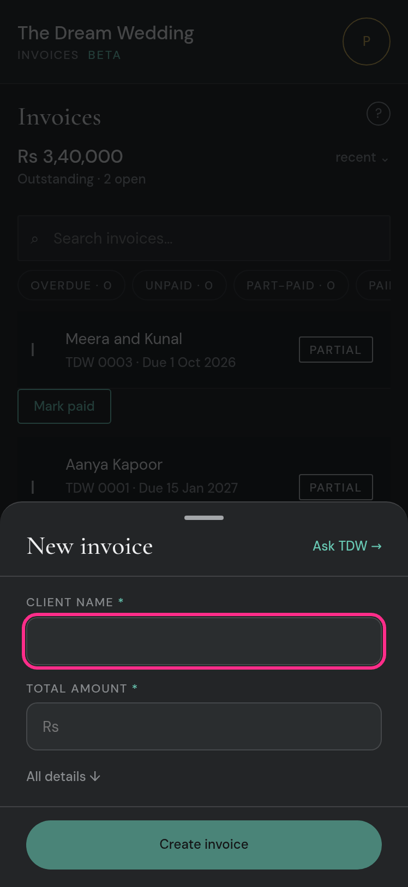

**Why.** "Client name" is free text; a typo makes a second client, and the package fee is typed again.
**Fix.** Start invoices from the client (or a client picker); the amount comes from the package.

#### E12. The invoice sheet has two filled primary buttons · Invoices · quick
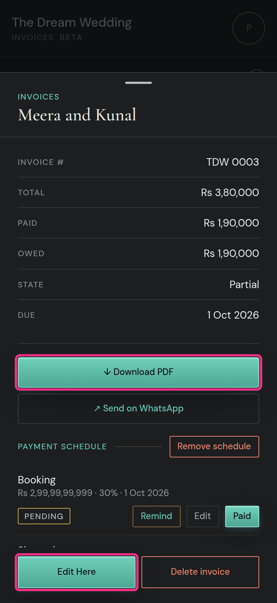

**Why.** Download PDF and Edit Here are both filled teal; Send on WhatsApp, the likely next step, is the plain one.
Remove schedule is red at the top of the plan.
**Fix.** One primary: Send on WhatsApp. PDF as a secondary; Edit and Remove schedule under More.

#### E13. The Today "Done today" table · Home · quick
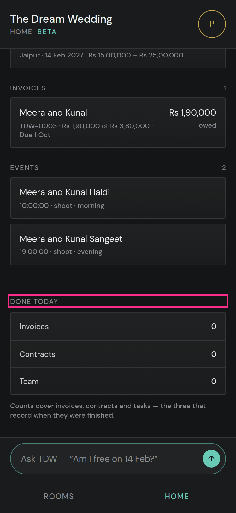

**Why.** Three rows of 0 and a sentence on what the counts cover, on every busy day.
**Fix.** Remove, or one line when something was done ("2 invoices paid today").

#### E14. The legacy pages are another design · onboarding, Discover · large
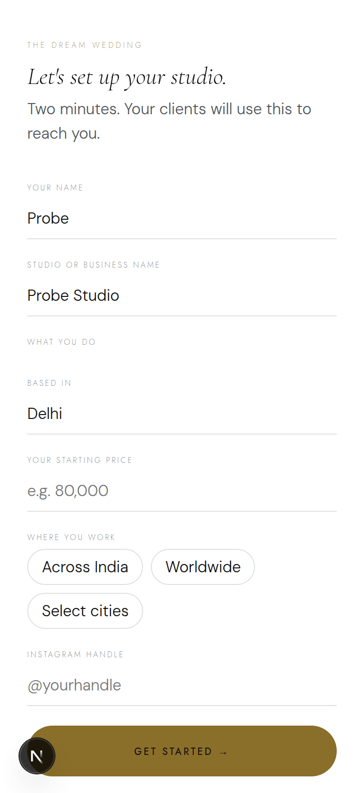 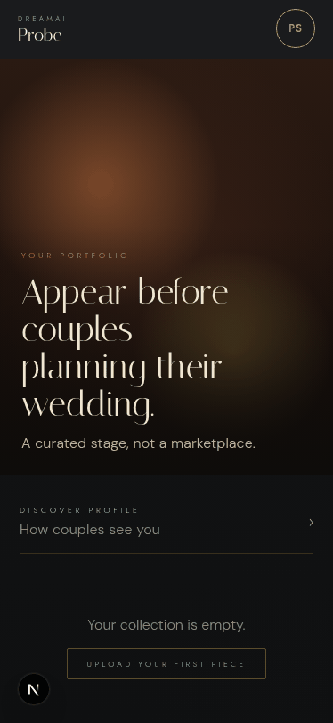

**Why.** The first thing a new vendor sees (onboarding) is italic serif on pure white with 11 px spaced capitals and
a gold button; Discover and its profile are in the older Espresso theme with Italiana display type and 9 px text.
**Fix.** Move them into the shell's theme and the one pattern; until then, at least the type and palette.

#### E15. Packages repeats its head and prices are in the serif · Packages · quick
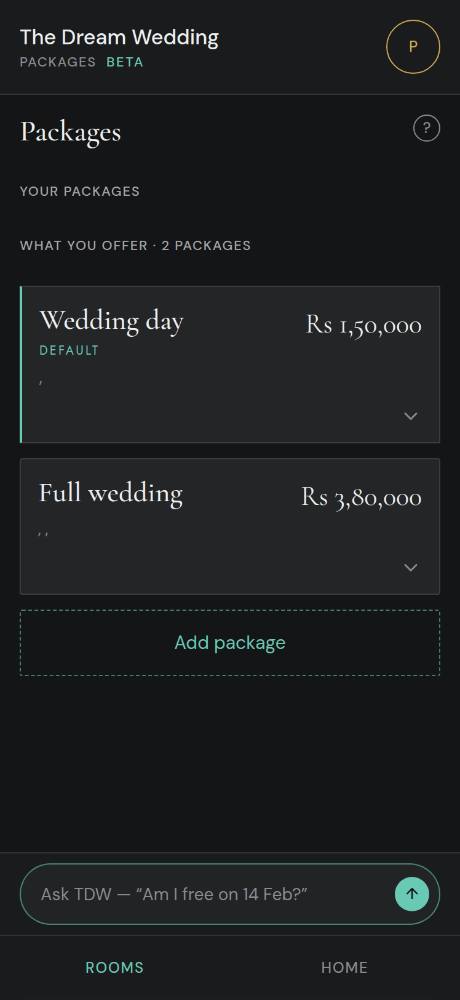

**Why.** "Your packages" and "What you offer · 2 packages" stack above the list; names and prices are in the display
serif with old-style figures.
**Fix.** One heading; prices in the body font with tabular figures.

### Polish

#### P1. The header sits under the iPhone status bar · every room · quick
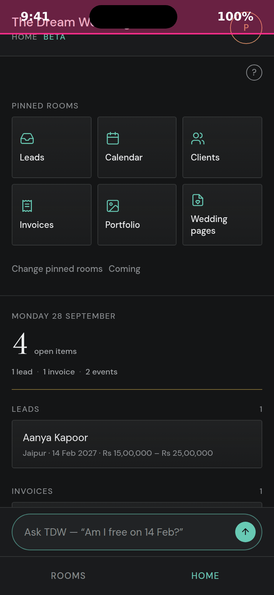

**Why.** `app/layout.tsx` sets `viewport-fit=cover` and `apple-mobile-web-app-status-bar-style` to
`black-translucent`, so an installed app draws under the status bar; the shell header's padding is a flat 16 px
with no `env(safe-area-inset-top)`. On a notched iPhone the wordmark and the profile coin sit under the clock and
the battery (the pink band is a 47 px status bar drawn over the real header). The bottom bar does pad for the home
indicator.
**Fix.** `.wl-hdr{padding-top:max(16px, env(safe-area-inset-top))}`; the same for sheets that reach the top.

#### P2. Controls under 44 px · many rooms · quick
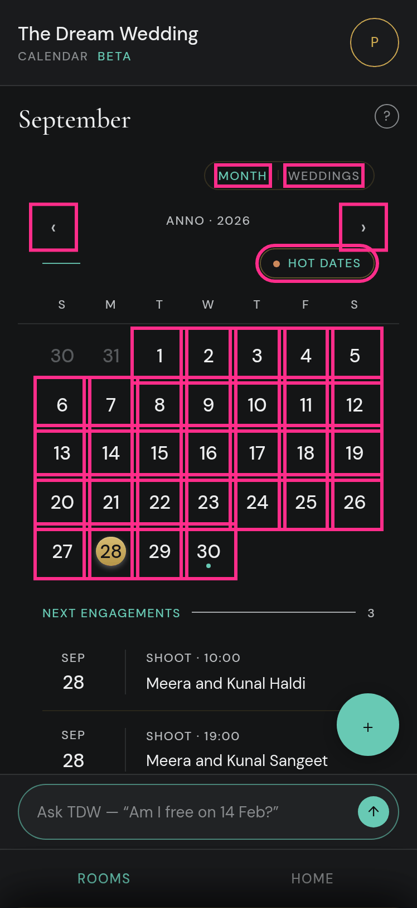 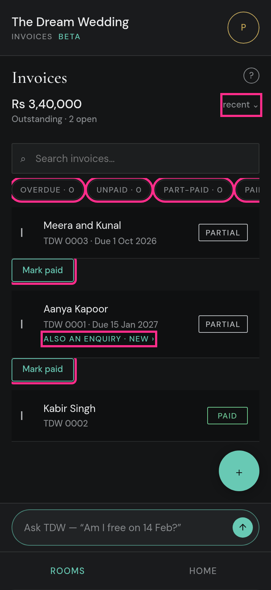

**Why.** Measured on the first screen of each room (tour data): Calendar's Month and Weddings (14 px high), "‹ ›"
(36 by 36), Hot dates (26), block reasons (28); every filter chip row (28) in Leads, Invoices, Events, Expenses;
the sort "recent ⌄" (25); "Also an enquiry · New ›" and "In your books" links (14); Clients "+ date" (25);
Invoices "Mark paid" (32) and the milestone Remind, Edit and Paid; Today's kind line (14); Team's tabs (17);
Collab's tabs and "+ Post"; Portfolio's filters (27) and "+ Upload" (31); TDS's years (27) and Export CSV (26);
Contracts' "Set up" (17); Couture's "Billing" (21); Settings' Copy (29). 87 in all on the iPhone tour, counting
the controls inside each room's closed sheets (some of those are 43 px, a pixel short).
**Fix.** A 44 px minimum hit area (padding or a pseudo-element) on every control; the proposed pattern uses 44 to 48.

#### P3. The add button and send arrow in light: 2.71 to 1 · every room · quick
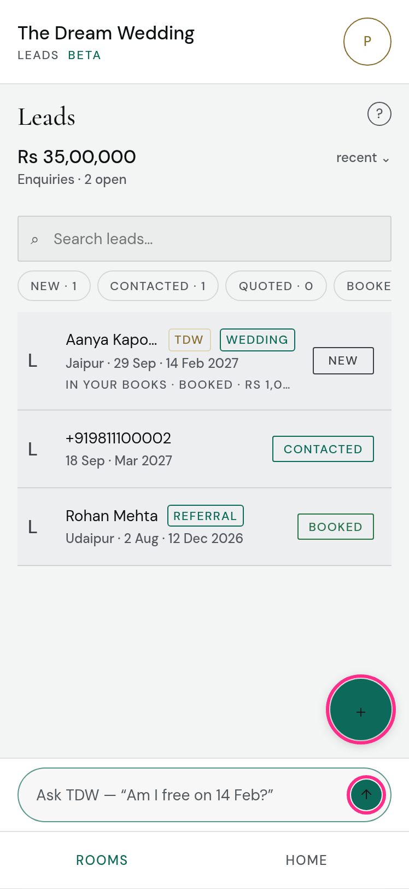

**Why.** Both fill with `accent-text` (dark teal in Chalk) and draw the glyph in `ink-deep` (near black): 2.71 to 1,
under the 3 to 1 bar for a control's icon. The "+" all but disappears.
**Fix.** The new `primary` and `on-primary` tokens (white on teal, 6.4 to 1 in Teal Ledger).

#### P4. White on the light primary buttons: 3.35 to 1 · Leads, Invoices, Expenses, Calendar · quick
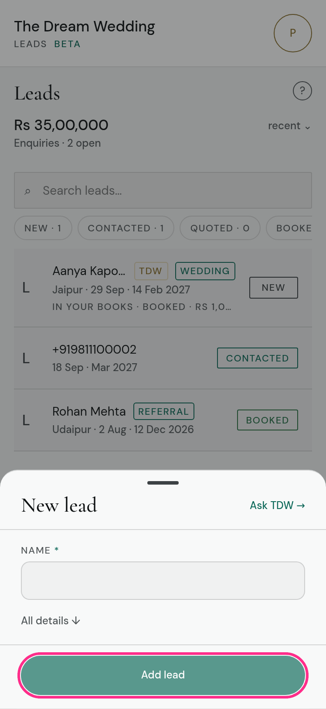

**Why.** Add lead, Create invoice, Log expense, Add event and Save crew put white 12 px text on a mid teal. Body text
needs 4.5 to 1.
**Fix.** `primary` `#0B6B5A` with white (6.43 to 1).

#### P5. Gold headings in light: 4.34 to 1 · Settings, Rooms, TDS, Couture · quick
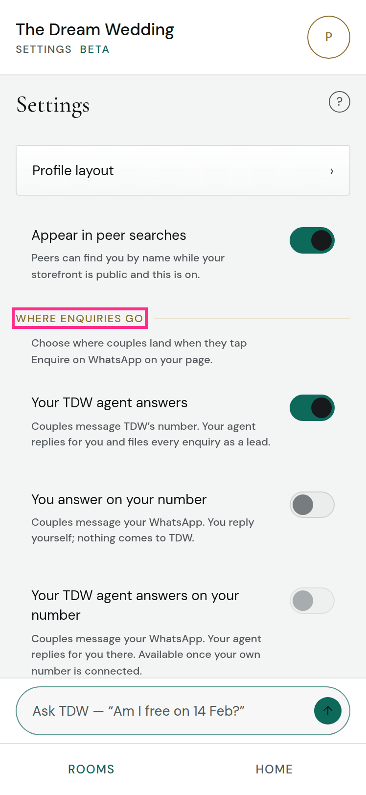

**Why.** `metal` `#8A6F2A` is used for text (section heads, Business Solutions, Storefront, the TDW chip at 4.12).
**Fix.** Gold for the brand mark only; headings in the text colour. If gold text stays, `#735A1C` (5.9 to 1).

#### P6. Faded text used for words · Calendar, Your website, Payment reminders · quick

**Why.** `ink-fade` is marked "no bar" in theme.ts, but it draws the other month's days (2.68 to 1 dark), "Add your
city" and an error line ("We could not load your reminders", 3.84 to 1 light).
**Fix.** Use `ink-mute` for any word; `ink-fade` for rules only.

#### P7. The WhatsApp icon is pure blue · Leads · quick
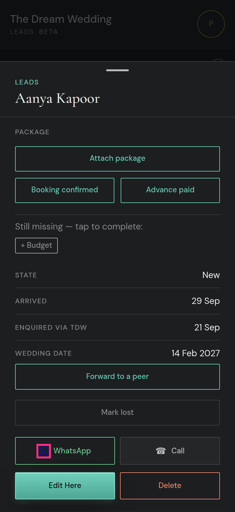

**Why.** The icon inside the WhatsApp button renders in the browser's default link blue (`rgb(0,0,238)`), 1.95 to 1
on the dark sheet, beside green text.
**Fix.** `color: inherit` (or `currentColor`) on the icon.

#### P8. Names and facts cut off in rows · Leads, Events · quick
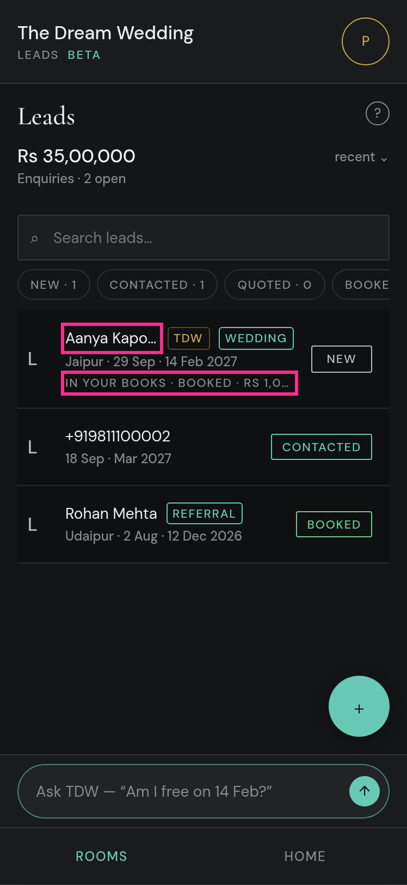

**Why.** "Aanya Kapo…" is cut because TDW and WEDDING chips share the name's line; "In your books · Booked · Rs
1,0…" and "In your books · Meera and…" are cut on every booked row.
**Fix.** The one row pattern: the name on its own line, one facts line, sources as words in the facts line.

#### P9. Filter chips run off the screen · Leads, Invoices, Events, Expenses (Android 360) · quick
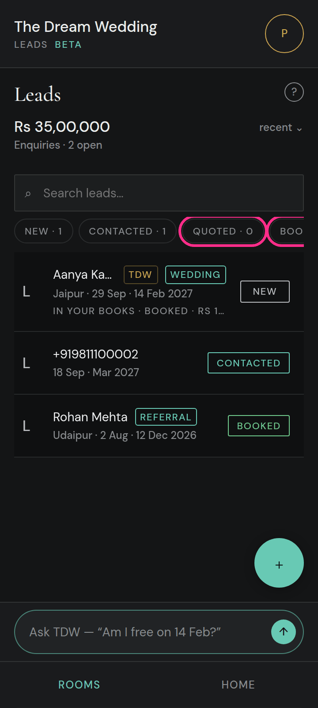

**Why.** Booked and Lost (Leads), Paid (Invoices) sit past the right edge with no sign the row scrolls.
**Fix.** A segmented control of at most four (New, Replied, Quoted, All); the rest under All.

#### P10. The add button covers content · Clients, Leads, Invoices · quick
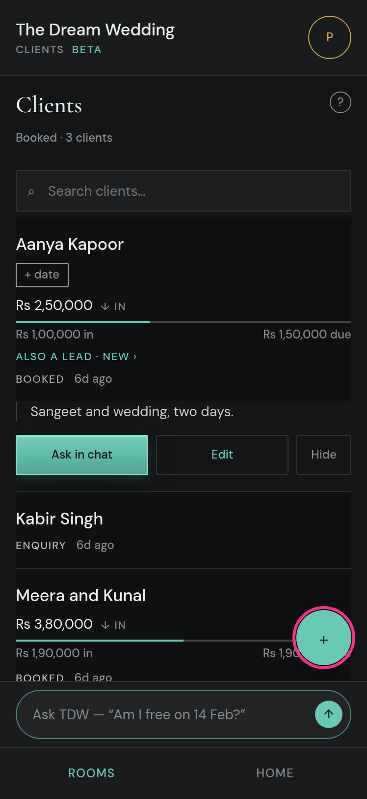

**Why.** The 56 px add button floats over the list at 136 px from the bottom; on Clients it covers "Rs 1,90,000
due" and, with a row open, the Hide button.
**Fix.** Pad the list's end by the button's height, or put "Add" in the room's head and drop the floating button.

#### P11. Main content needs a scroll · Home, Leads, Invoices · medium
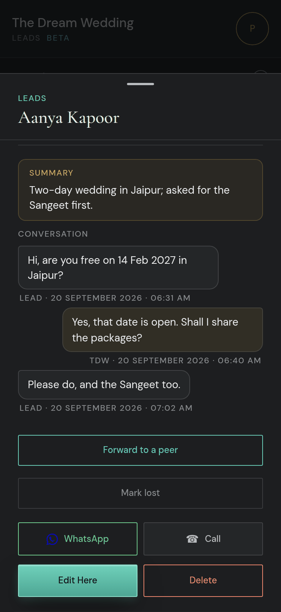

**Why.** Home's events, the enquiry's conversation and the invoice's payment plan are all below the first screen,
under blocks the vendor did not come for.
**Fix.** The order in section 3; fixed action bars so the main button never scrolls away.

#### P12. Three levels of sheets · Leads, Calendar · medium
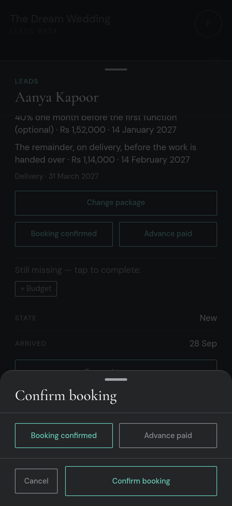

**Why.** Enquiry sheet, then Attach package, then Confirm booking; day sheet, then Assign crew. Each level dims the
one below and the way back is a drag or a Cancel.
**Fix.** Tab, then record page; at most one sheet on top.

#### P13. Buttons in four styles and two primary colours · app-wide · medium
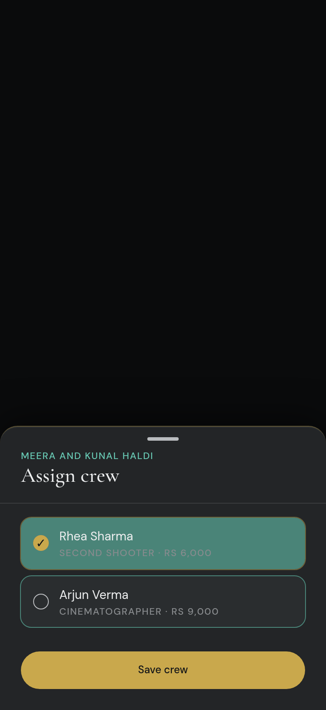

**Why.** 2 px square outlines (sheets), pills (calendar), round (the add button), filled gradient (Edit Here); teal
primaries and a gold primary (Save crew, Get started).
**Fix.** One button spec (section 3), one primary colour.

#### P14. Rows in five styles · Leads, Invoices, Events, Clients, Today · quick
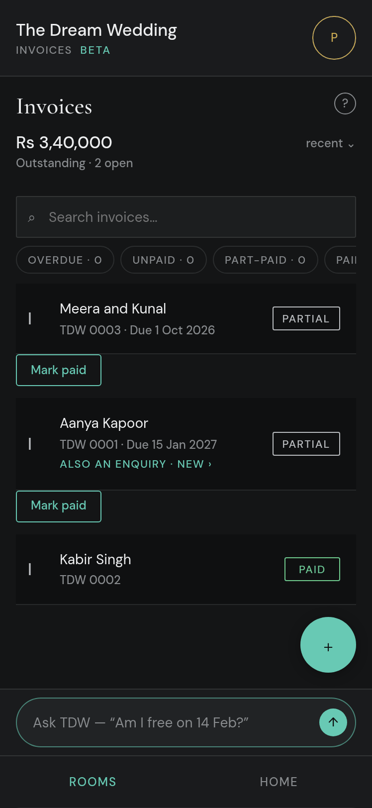 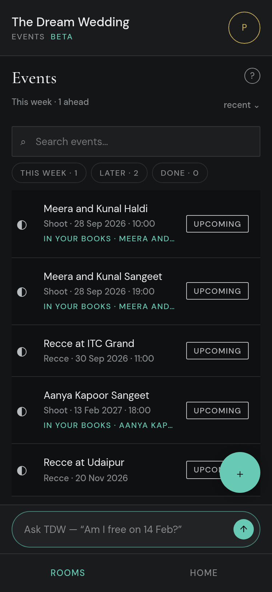

**Why.** Leads draw an "L" in a column, Invoices an "I", Events a half-moon, Clients no icon and expand in place,
Today uses cards. The single letters carry no meaning.
**Fix.** The one row pattern.

#### P15. The light theme's white grounds · every room in Chalk · quick (values) to medium (palette)
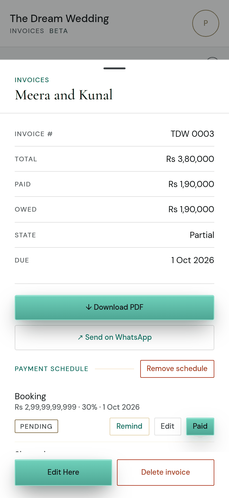

**Why.** Header and sheets `#FFFFFF`, cards 94 percent white over a `#F3F4F4` page. The founder's eye strain.
**Fix.** Teal Ledger light (section 4).

#### P16. Tiny spaced capitals · Portfolio, Collab, Couture, legacy · quick
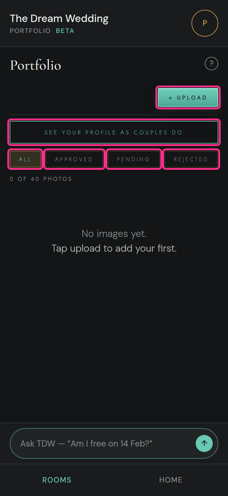

**Why.** "+ Upload" measures 9 px with wide tracking; Portfolio's filters and "See your profile as couples do" are
11 px capitals. Below the app's own 11 px floor.
**Fix.** 13 px floor, sentence case (section 5).

#### P17. The header spends 76 px to repeat the room's name · every room · medium
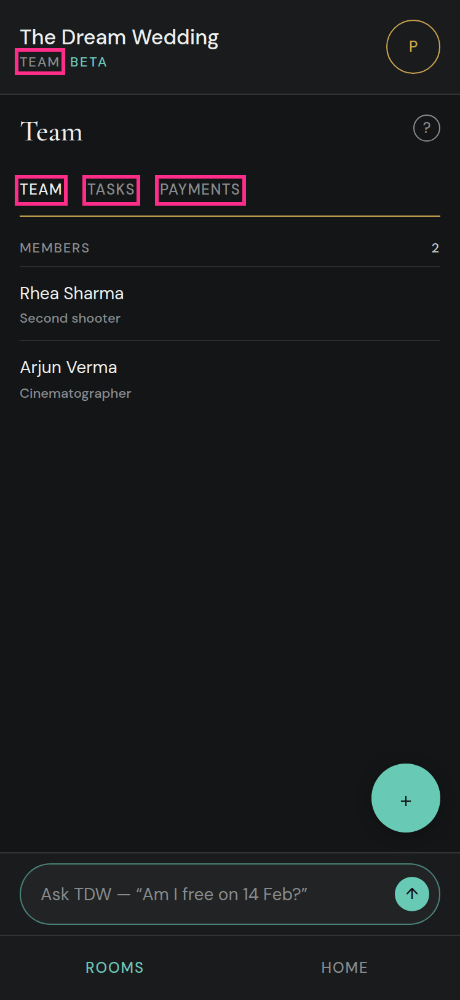

**Why.** "The Dream Wedding / TEAM BETA" and then "Team" as the page title: the name twice, 140 px before any
content on a 812 px screen that also gives 64 px to Ask TDW and 52 px to the bar.
**Fix.** A 56 px header with the page title in it (and the TDW mark only on Today); Ask TDW off the permanent dock.
Team's tabs (17 px high, same screenshot) become a segmented control at 44 px.

### Words

#### W1. Dashes in the app's own words · app-wide · quick
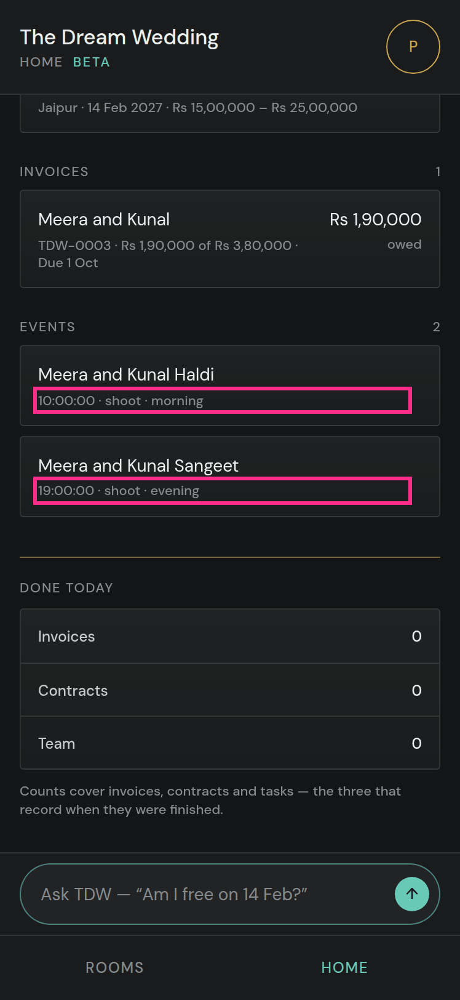

**Why.** The rule is no dashes. On screen: "Ask TDW — “Am I free on 14 Feb?”" (every room), "Still missing — tap to
complete:", "Follow up — Kabir Singh: Send the teaser", "Rs 45,000 due — Aanya Kapoor (1 of 3)", "Rs 15,00,000 –
Rs 25,00,000", "28 Sep — 29 Sep", "Counts cover invoices, contracts and tasks — the three that record…", "Yes — mark
Aanya Kapoor lost", "This one’s further along — marking lost…", "Optional — it lands in the notes". `lib/worklist/copy.ts`
alone holds 9.
**Fix.** "Ask TDW, for example: Am I free on 14 Feb?"; "Add what is missing:"; "Rs 15 to 25 lakh"; "28 and 29 Sep".

#### W2. "She" and "her" in the app's words · Payment reminders, WhatsApp and Instagram · quick
**Why.** The rule is no he or she. `lib/worklist/copy.ts`: "Send that with the reminder if she needs them."
`lib/worklist/metaRoom.ts`: "we answer her question … take her details, and add her to your leads" and "we stay
quiet with her for".
**Fix.** "if the couple needs them"; "we answer the question, take the details and add the couple to your
enquiries"; "we stay quiet in that chat for".

#### W3. Words a vendor would not use · app-wide · quick
**Why.** Rooms, Business Solutions, Books, Couture, Exchange, Collab, Anno, Next engagements, Loose engagements, Hot
dates, Edit Here, In your books, Pinned rooms, Beta on every header.
**Fix.** Sections instead of rooms (Today, Enquiries, Calendar, Clients, Money, More); "Year"; "Coming up";
"Other events"; "Good dates"; "Edit"; "Also a client"; drop Beta from the header (keep it in More).

#### W4. Raw data shown as words · Today, Leads, Invoices, Events · quick

**Why.** "10:00:00 · shoot · morning" (seconds, lower-case kind, the slot repeating the time); states in capitals
("PARTIAL", "CONTACTED"); "+919811100002" unspaced; "TDW-0003" on Home and "TDW 0003" in Invoices.
**Fix.** "10:00 · Haldi"; "Part paid", "Replied"; "+91 98111 00002"; one invoice number format.

#### W5. One thing, two names · Leads and Enquiries, the vendor's own reply · quick
**Why.** The room is Leads; its rows are "Enquiries · 2 open"; Invoices says "Also an enquiry"; Clients says "Also a
lead". In the conversation the vendor's own reply is stamped "TDW".
**Fix.** "Enquiry" everywhere. Stamp a reply "You" or "TDW for you".

#### W6. Enquiry routing is three switches for one choice · Settings · medium

**Why.** "Your TDW agent answers", "You answer on your number" and "Your TDW agent answers on your number" are three
toggles with a paragraph each, but only one can be true.
**Fix.** One choice of three (radio), each one line, the detail under "What this means".

---

## 8. Measures behind the findings

`tools/tour.mjs` opens every drawing route under `app/vendor/(shell)/` (34) in each theme and phone and records:
controls under 44 px, text under its contrast bar (colour composited over the real background), elements past the
right edge, text cut by an ellipsis, sideways scroll. Results: `tools/data/tour-<theme>-<phone>.json`. Two notes on
reading them: text inside closed sheets is measured too (it is in the page), and buttons with a gradient fill are
measured against the colour behind them, so each number used in this report was checked on a screenshot first.
No room scrolls sideways at 360 or 374.

---

## 9. How the review was run

1. `npm ci`, then the app in mock mode as benches b140 and b143 run it:
   `NEXT_PUBLIC_USE_MOCKS=true NEXT_PUBLIC_API_BASE=http://localhost:3990/__api npx next dev -p 3990`.
2. The demo vendor is the benches' all-zero id; every API read is answered in the browser from the benches' own
   fixtures (`scripts/lib/b123_fixtures.mjs`) plus a busy Monday added in `tools/harness.mjs` (two functions today
   with crew, a new enquiry three hours old, an invoice due in three days, two packages). The theme is chosen by the
   shell's cookie (`tdw_wl_mode`), the service worker bypassed, and the real DM Sans and Cormorant faces loaded, as
   b123 does.
3. Scripts, all under `docs/review/tools/`: `tour.mjs` (every room, measures), `flows.mjs` (the five tasks),
   `findings.mjs` (the marked screenshots), `legacy.mjs`, `palettes.mjs` (tokens and every contrast pair; exits 1
   on a failure), `mocks.mjs` (the prototype in the real shell), `compose.py` (the boards), `extract-shell.mjs` and
   `build-html.mjs` (the HTML mock-ups), `check-html.mjs` (walks every mock-up's buttons from `file://`).
4. Limits. The data is mock data, so write results (after Attach package, Confirm booking, Create invoice) are the
   harness's answers, not the server's: the flows show the screens and the taps, not what the server stores.
   Screenshots are headless Chromium with a phone viewport, not a device; the notch finding is drawn from the
   header's CSS, not photographed on an iPhone. Every PNG is under 400 KB.

---

## 10. Time

By the container's clock: started 21:07 UTC, report written 21:43 UTC, 28 September 2026, so about 40 minutes of wall time, with the tours, flows and mock screenshots running in the background while the findings were read.
